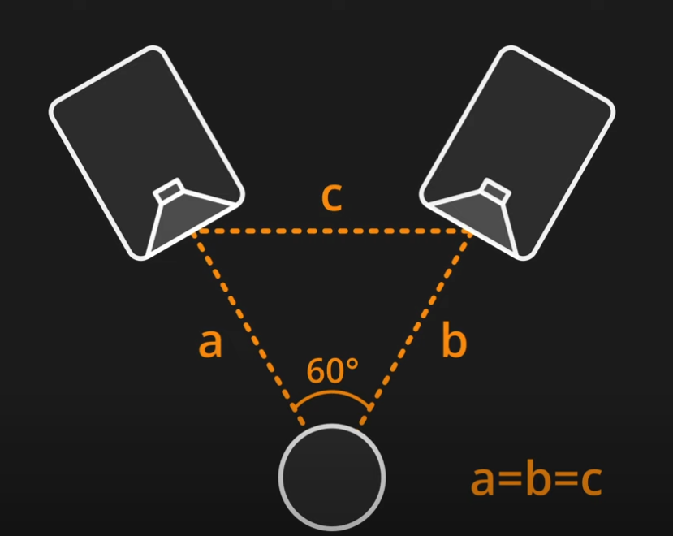
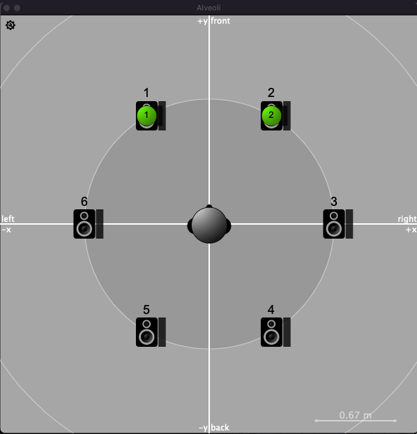

# Alveoli

## Max for Live Device version 1.3 for HexaStereo™ system.

### Designed with Spat 5.3.2, for OSX and Windows.

### Alveoli is a Stereo Panner for Hexaphony for Outdoor Amplified Music.
--------
Traditionally, in stereo, the azimuth between the listener and the speakers is ideally placed at **-30 degrees and +30 degrees.**

  

---------
The positions of the first stereo output (1 and 2) are frontal, so we have the classic stereo foreground, the panning is done on the 6 possible positions always describing a stereo rendering

This panner therefore offers surround panning rendering in this configuration, where the **6 speakers** are oriented at **60 degrees** to each other, and which are **equidistant** from the listener position. This is the principle of HexaStereo™.

  

----------
Here is an example of Live Set to help you find your way around, **the device is inside.**

In the master track you'll hear a binaural panning monitoring, and the hexaphony is send to return tracks.

Panning uses 6 presets buttons for a perfect position for rendering, but you can interpolate by hand, Azimuth can be controlled by automation.

Feel free to contact me in the [discussion room](https://discussion.forum.ircam.fr/c/alveoli/)

*HexaStereo™ is a trademark of Lotus Open Factory* 
